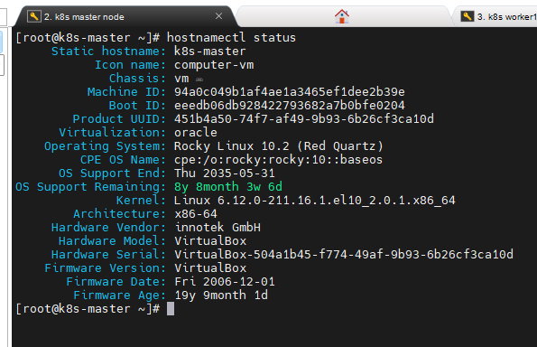

# 0002. OS 버전 선택 — Rocky Linux 10.2

## Context
프로젝트 최초 계획에는 Rocky Linux 9로 명시되어 있었으나, RHCSA 실습 중 이미 구축해둔 Rocky Linux 10.2 VM 2대를 보유하고 있어 이를 재활용하는 방향으로 변경함.

## Decision
Rocky Linux 10.2를 이 프로젝트의 OS로 채택한다.

## Why
- 이미 만들어둔 VM을 템플릿으로 활용하면 설치 과정 없이 바로 Phase 0을 진행할 수 있음 
- RHCSA 학습 때 사용한 환경과 동일해 익숙함

## 대안과의 비교
| 대안 | 장점 | 단점 | 채택 여부 |
|------|------|------|-----------|
| Rocky Linux 9 (원안) | K8s 공식/containerd 저장소가 RHEL 9 계열 기준으로 가장 많이 검증됨 | 새로 설치 필요 (ISO는 9.8 minimal만 보유) | 미채택 |
| Rocky Linux 10.2 (채택) | 기존 VM 재사용, 설치 시간 절약 | 아래 리스크 참고 | 채택 |

## 감수하는 리스크
- K8s 공식 패키지 저장소·containerd 저장소가 RHEL 9 계열 기준으로 더 많이 검증되어 있어, Rocky 10 계열은 kubeadm/containerd 호환성이 상대적으로 덜 검증됨
- Rocky 9→10 사이 cgroup v2 처리 방식, nftables 백엔드 기본값 등이 바뀌었을 가능성 → kubelet cgroup driver, kube-proxy iptables 동작에 영향 가능
- 실제 이슈 발생 시 Incident 문서(S-T-A-R)로 전환해 트러블슈팅 소재로 활용할 계획

## Evidence

## Result
(Phase 2 kubeadm init 이후 실제 이슈 발생 여부를 보고 갱신 예정)