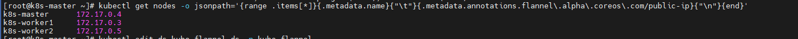
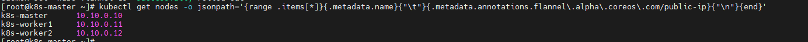

# 0005: Flannel VXLAN 언더레이 인터페이스 명시적 지정 (--iface=enp0s9)

## Context
- Day 1 결정(0001)에서 Host-only(관리용)/Internal(클러스터 통신 전용) 이중 네트워크 구성을 채택
- Day 2에서 Host-only·Internal 인터페이스에 `ipv4.never-default yes`를 설정 → NAT(enp0s3)만 기본 경로를 갖도록 구성
- Day 7에 Flannel을 공식 매니페스트 그대로(추가 옵션 없이) 설치
- Day 8 Phase 3 네트워크 심화 조사 중, `bridge fdb` / `ip neigh` / Node의 `flannel.alpha.coreos.com/public-ip` annotation을 확인한 결과, Flannel의 VXLAN 언더레이 목적지 주소가 의도한 Internal망(10.10.0.0/24)이 아니라 NAT망(172.17.0.0/24)으로 등록되어 있음을 발견

## Decision
kube-flannel DaemonSet의 컨테이너 args에 `--iface=enp0s9`를 추가하여, Flannel이 자동 탐지 대신 Internal Network 인터페이스를 명시적으로 사용하도록 고정한다.

## Why
- Flannel은 `--iface` 미지정 시 "노드의 기본 경로를 가진 인터페이스"를 자동으로 대표 IP(공인 IP)로 선택하는데, Day 2 설정상 기본 경로를 가진 유일한 인터페이스가 NAT였기 때문에 의도치 않게 NAT망이 선택됨
- NAT 인터페이스는 DHCP로 IP를 임대받는 방식(`valid_lft`가 짧게 갱신)이라, 향후 임대 갱신 시 IP가 바뀌면 Flannel의 정적 FDB/ARP 매핑이 깨져 노드 간 Pod 통신이 끊길 위험이 있음
- kubelet의 InternalIP는 kubeadm init 시 `--apiserver-advertise-address=10.10.0.10`으로 명시했기 때문에 Internal망으로 정확히 설정돼 있었지만, Flannel은 이 값을 참조하지 않고 독립적으로 인터페이스를 재탐지하므로 두 컴포넌트의 판단이 어긋날 수 있음을 확인

## 대안과의 비교
| 대안 | 장점 | 단점 | 채택 여부 |
|---|---|---|---|
| `--iface=enp0s9` 명시 (채택) | 설정 한 줄로 명확히 고정, 재현성 높음 | 워커 노드들의 인터페이스 이름이 동일(enp0s9)해야 함 (클론 방식이라 보장됨) | ✅ |
| `--public-ip` 노드별 개별 지정 | 인터페이스 이름이 노드마다 달라도 대응 가능 | 노드 추가/제거마다 수동 설정 필요, 관리 부담 큼 | ❌ |
| Flannel 자동탐지 그대로 유지 | 설정 불필요 | NAT망(DHCP) 의존으로 IP 변경 시 장애 위험 상존, Day 1 설계 의도(망 분리) 위반 | ❌ |

## Result
- `kubectl patch daemonset kube-flannel-ds -n kube-flannel --type=json -p='[{"op":"add","path":"/spec/template/spec/containers/0/args/-","value":"--iface=enp0s9"}]'`로 적용
- DaemonSet 롤링 업데이트(maxUnavailable=1)로 3개 노드 Flannel Pod 순차 재시작
- 재시작 후 `flannel.alpha.coreos.com/public-ip` annotation이 3개 노드 모두 `10.10.0.10 / .11 / .12`로 정상화됨을 확인
- `kubectl edit`은 수동 YAML 편집 중 들여쓰기 오류로 1차 시도 실패 → `kubectl patch`(JSON patch)로 재시도해 성공. 터미널에서 DaemonSet spec을 안전하게 수정하는 방법으로 기록해둘 만함

## Evidence

