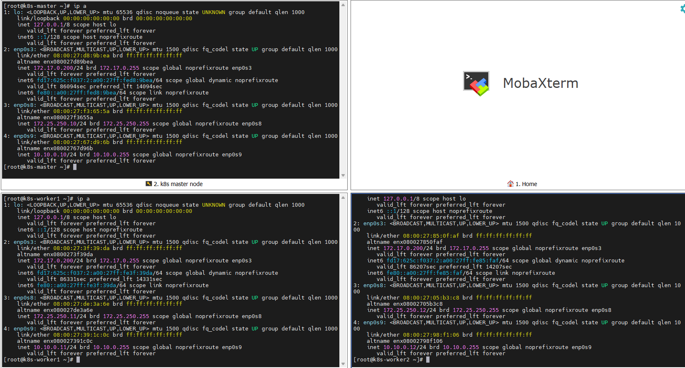
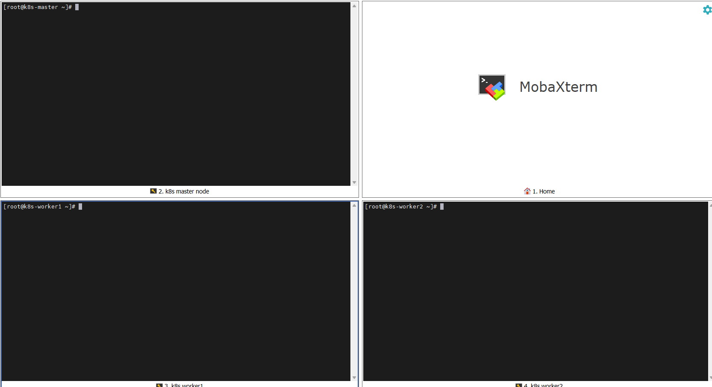

# 2026-09-02 — Day 02 (Phase 0)

## 오늘 목표
- VM 3대 생성(마스터1+워커2), Host-only/Internal 네트워크 어댑터 설정, SSH 접속 확인
- decisions/0002-os-selection.md 작성 (Rocky 10.2 선택 근거 + 리스크)

## 오늘 한 일
- 기존 RHCSA Rocky Linux 10.2 VM(v10node1)을 템플릿으로 네트워크 어댑터 3종(NAT/Host-only/Internal) 세팅 후 Full Clone 2회 실행 → k8s-master, k8s-worker1, k8s-worker2 생성
- 클론 직후 발생하는 "복제 후유증" 정리: hostname 변경, machine-id 재생성, SSH host key 재생성
- 인터페이스-어댑터 매핑 확인(MAC 주소 대조): enp0s3=NAT, enp0s8=Host-only, enp0s9=Internal Network
- VirtualBox 전역 네트워크 설정에서 Host-only 실제 대역 확인: `VirtualBox Host-Only Ethernet Adapter #2`, 172.25.250.0/24, DHCP 사용 안 함
- nmcli로 3대에 고정 IP 할당
  - Host-only: master 172.25.250.10/24, worker1 .11/24, worker2 .12/24
  - Internal(임의 지정): master 10.10.0.10/24, worker1 .11/24, worker2 .12/24
  - 둘 다 `ipv4.never-default yes`로 설정해 기본 경로가 NAT(enp0s3)로만 고정되게 함
- 호스트 PC(Windows, MobaXterm)에서 3대 모두 SSH 접속 확인 완료

## 왜 이 설정/방법을 선택했는가
| 항목 | 선택한 것 | 대안 | 선택 이유 |
|------|-----------|------|-----------|
| VM 생성 방식 | 기존 RHCSA VM 1대를 템플릿으로 Full Clone | Rocky 10.2 ISO로 3대 새 설치 | 10.2 ISO 미보유 + 이미 확보한 VM 재사용이 훨씬 빠름. Full Clone(Linked Clone 아님)으로 템플릿과 완전히 독립시켜 나중에 템플릿을 건드려도 안전 |
| Host-only 대역 | 172.25.250.0/24 (기존 #2 어댑터 그대로 사용) | 새 Host-only 네트워크 생성 | 이미 만들어진 어댑터를 그대로 사용 — 서브넷 값 자체는 임의라 문제 없음 |
| Internal 대역 | 10.10.0.0/24 (임의 지정) | Host-only와 같은 대역대 사용 | 대역이 겹치면 라우팅 판단이 꼬일 수 있어 완전히 분리 |
| IP 할당 방식 | nmcli로 static 수동 할당 | DHCP | Host-only/Internal 둘 다 DHCP 없음/꺼짐. 클러스터 노드는 IP가 고정이어야 kubeadm/Flannel 설정이 안정적임 |

## 오늘 처음 안 사실
| 몰랐던 것 | 알게 된 것 | 왜 그렇게 되는지 |
|-----------|-----------|----------------|
| NAT 어댑터의 IP가 VM마다 똑같아도 되는 이유 | "NAT" 어댑터는 VM 한 대당 완전히 독립된 가상 사설망을 만들어줌 | 각 VM의 NAT망은 서로 존재를 모르는 별개의 네트워크라 같은 사설 IP(172.17.0.200)를 써도 충돌 없음 (집집마다 공유기가 192.168.1.1을 쓰는 것과 같은 원리) |

## 검증 결과
```bash
# 3대 공통
ip -4 a show enp0s8   # Host-only IP 확인 (172.25.250.10/11/12)
ip -4 a show enp0s9   # Internal IP 확인 (10.10.0.10/11/12)
ip route              # default 경로가 enp0s3 하나만 잡히는지 확인

# 호스트(Windows)에서
ping 172.25.250.10/11/12         # 전부 응답
ssh root@172.25.250.10/11/12     # MobaXterm, 3대 모두 접속 성공
```

## 결과·증거
- 캡처: `evidence/day02-network-final-ok.png` (3대 nmcli/ip route 최종 상태)


- 캡처: `evidence/day02-ssh-multi-session-ok.png` (MobaXterm 4분할 SSH 접속 화면)



## 막힌 점
- 없음
