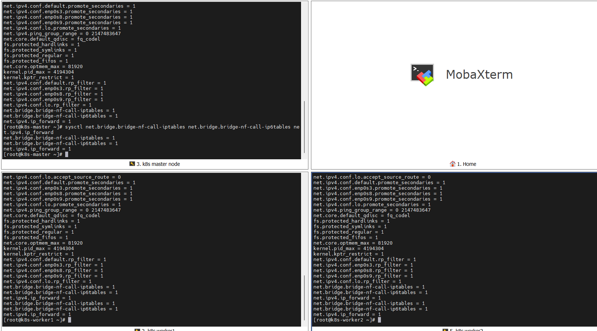
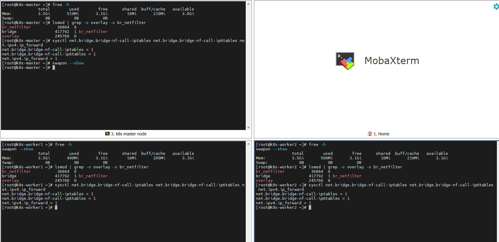

# 2026-09-04 — Day 03 (Phase 1)

## 오늘 목표
- 전 노드(master, worker1, worker2) swap 비활성화
- br_netfilter, overlay 커널모듈 로드 및 부팅 시 자동 로드 설정
- sysctl 파라미터 설정
- 재부팅 후에도 위 설정이 유지되는지 검증

## 오늘 한 일
- `swapoff -a` 및 `/etc/fstab` swap 라인 주석 처리 (3대)
- `overlay`, `br_netfilter` 모듈 `modprobe`로 즉시 로드 + `/etc/modules-load.d/k8s.conf` 등록 (3대)
- `/etc/sysctl.d/k8s.conf` 생성 및 `sysctl --system` 적용 (3대)
- 3대 모두 재부팅 후 swap/모듈/sysctl 값 재검증

## 왜 이 설정/방법을 선택했는가
| 항목 | 선택한 것 | 대안 | 선택 이유 |
|------|-----------|------|-----------|
| swap 처리 | `swapoff -a` + fstab 주석 | zram 유지 후 kubelet `--fail-swap-on=false`로 우회 | kubeadm 표준 방식, 스케줄러의 리소스 예측 정확도 확보 |
| 브리지 필터링 활성화 | `br_netfilter` 모듈 로드 + sysctl 두 단계로 명시적 활성화 | (해당 없음, kubeadm 필수 사전조건) | Pod 네트워크가 브리지(`cni0`)를 거치므로, iptables 기반 kube-proxy가 정상 동작하려면 필수 |

## 오늘 처음 안 사실 (실제로 헷갈렸던 것 위주)

| 몰랐던 것(내가 착각했던 것) | 알게 된 것 | 왜 그렇게 되는지 |
|-----------|-----------|----------------|
| `br_netfilter`가 브릿지(`cni0`) 그 자체인 줄 알았음 | 브릿지는 아직 존재하지도 않음(Phase 3에서 Flannel 설치할 때 `cni0`가 생김). `br_netfilter`는 그냥 "나중에 브릿지가 생기면, 거길 지나는 트래픽도 iptables를 거치게 만들어주는 사전 스위치"일 뿐 | 리눅스 브리지(L2 스위치 역할)는 원래 iptables(netfilter)를 거치지 않는 게 커널 기본 동작이라서, 이 스위치를 미리 안 켜두면 나중에 kube-proxy가 만든 iptables NAT 규칙이 Pod 트래픽에 아예 적용이 안 됨 |
| `modprobe`만 하면 끝인 줄 알았음 | `modprobe`는 지금 이 순간만 메모리에 모듈을 올리는 거라 재부팅하면 초기화됨. `/etc/modules-load.d/*.conf`에 등록해야 부팅 시 자동으로 다시 로드됨 | systemd가 부팅 과정에서 이 디렉터리를 읽어서 모듈을 로드해주는 별도 서비스(`systemd-modules-load.service`)가 있기 때문 |

## 검증 결과
```bash
# 재부팅 전/후 3대 공통 확인
free -h                # Swap: 0B 0B 0B
swapon --show          # 출력 없음 (스왑 없음)
lsmod | grep -e overlay -e br_netfilter   # br_netfilter, bridge, overlay 모두 표시
sysctl net.bridge.bridge-nf-call-iptables net.bridge.bridge-nf-call-ip6tables net.ipv4.ip_forward
# net.bridge.bridge-nf-call-iptables  = 1
# net.bridge.bridge-nf-call-ip6tables = 1
# net.ipv4.ip_forward                 = 1
```
재부팅 후에도 동일 결과 확인 완료.

## 결과·증거



## 막힌 점
- 특이사항 없음