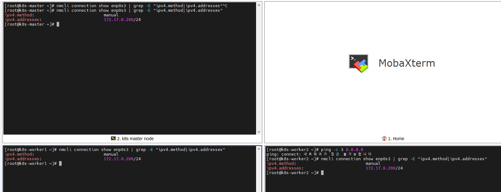
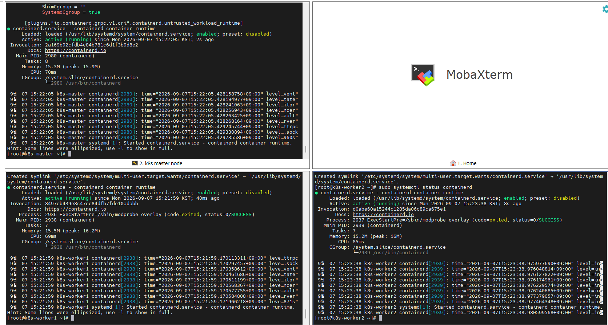

# 2026-09-07 — Day 04 (Phase 1)

## 오늘 목표
- 전 노드(master, worker1, worker2)에 containerd 설치
- `SystemdCgroup = true` 설정으로 kubelet과 cgroup 드라이버 사전 정합성 확보

## 오늘 한 일
- (계획에 없던 트러블슈팅) enp0s3(NAT 어댑터) 활성화 실패 → 원인 규명 → 3대 전부 DHCP로 복구
- Docker CE 공식 저장소 추가 (`download.docker.com/linux/centos/docker-ce.repo`) 후 `containerd.io-1.7.29` 3대 설치
- `containerd config default`로 기본 설정 생성 후 `SystemdCgroup = false → true` 변경
- `systemctl enable --now containerd`로 3대 전부 서비스 활성화 및 정상 기동 확인

## 왜 이 설정/방법을 선택했는가

| 항목 | 선택한 것 | 대안 | 선택 이유 |
|------|-----------|------|-----------|
| containerd 버전 | 1.7.29 (1.x 최신) | 2.3.4-2 (2.x 최신) | 2.0부터 CRI 플러그인 경로가 `io.containerd.grpc.v1.cri` → `io.containerd.cri.v1.runtime`로 바뀌어서, 온라인 자료 대부분(1.x 기준)과의 정합성을 위해 1.x 라인 유지. 최신 기능보다 학습 자료와의 호환을 우선함 |
| enp0s3(NAT) IP 정책 | DHCP(auto) | 노드별 고정 IP 재부여 | enp0s3은 순수 인터넷 아웃바운드 용도라 식별자 역할이 필요 없음 (관리 접속은 host-only가 담당). 굳이 고정할 이유가 없어 원래 설계 의도(Day1 decisions/0001)대로 DHCP로 복원 |
| cgroup 드라이버 | systemd | cgroupfs | Rocky Linux는 systemd로 부팅되므로, containerd가 cgroupfs를 쓰면 systemd와 동일 cgroup 트리를 서로 다른 방식으로 관리하려는 충돌(single-writer 원칙 위반) 가능성 있음. Day 5에 설치할 kubelet도 systemd 드라이버를 기본 전제로 하므로 미리 맞춰둠 |

## 오늘 처음 안 사실

| 몰랐던 것 | 알게 된 것 | 왜 그렇게 되는지 |
|-----------|-----------|----------------|
| VM 클론 시 위험 요소 | hostname/machine-id/SSH host key뿐 아니라, **네트워크 어댑터의 고정 IP 설정도 클론되면 그대로 복사됨** | Full Clone은 디스크 전체를 복사하므로 `/etc/NetworkManager/system-connections/*.nmconnection` 안의 고정 IP 값까지 그대로 복제됨. Host-only/Internal은 Day2때 손으로 재설정했지만 NAT(enp0s3)은 누락되어, 3대가 동일 IP(172.17.0.200)로 충돌 |
| nmcli의 "빈 문자열로 clear" | `ipv4.addresses ""`로 지웠다는 응답이 와도 실제 `.nmconnection` 파일엔 반영이 안 되는 경우가 있었음 (worker2에서 재현) | nmcli 명령 성공 응답과 실제 디스크 반영이 항상 동기화되는 게 아님 → 확실히 하려면 `cat`으로 실제 keyfile을 직접 열어 확인해야 함 |
| containerd 2.0의 변화 | config version 3부터 CRI 플러그인이 `io.containerd.cri.v1.runtime` / `io.containerd.cri.v1.images`로 분리됨 | containerd 2.0에서 플러그인 아키텍처가 재구성되면서 CRI 관련 설정 경로가 통째로 바뀜. 1.x 문법 기준 자료를 그대로 2.x에 쓰면 안 먹힘 |
| NetworkManager 파일 직접 수정 시 | 파일을 고쳐도 `nmcli connection reload`로 명시적으로 다시 읽게 해야 반영됨 | NetworkManager는 디스크 파일 변경을 자동 감지하지 않고, 메모리에 올라온 상태를 기준으로 동작함 |

## 검증 결과

```bash
# 1. NAT 어댑터 IP 충돌 확인 (3대 전부 동일 증상)
$ nmcli connection show enp0s3 | grep -E "ipv4.method|ipv4.addresses"
ipv4.method:    manual
ipv4.addresses: 172.17.0.200/24        # master/worker1/worker2 전부 동일 → 원인 확정

# 2. 복구 후 검증 (worker1 예시, 3대 전부 동일 패턴 확인)
$ ip a show enp0s3 | grep inet
    inet 172.17.0.3/24 ... dynamic ... enp0s3     # DHCP로 정상 수령, 중복 주소 없음
$ ping -c 3 8.8.8.8
3 패킷이 전송됨, 3 수신됨, 0% packet loss

# 3. containerd 설치 및 설정 검증 (3대 공통)
$ containerd --version
containerd containerd.io v1.7.29 442cb34bda9a6a0fed82a2ca7cade05c5c749582

$ grep -B2 -A2 "SystemdCgroup" /etc/containerd/config.toml
        SystemdCgroup = true

$ systemctl status containerd --no-pager
● containerd.service - containerd container runtime
     Active: active (running)   # master, worker1, worker2 전부 확인
```

## 결과·증거



## 막힌 점
- enp0s3(NAT)이 갑자기 인터넷이 안 되는 문제로 예정에 없던 네트워크 트러블슈팅에 시간을 많이 씀
  - 원인: 클론 템플릿에 고정 IP(172.17.0.200)가 남아있어서 3대가 동일 IP로 충돌 (master가 선점, worker1/worker2는 활성화 실패)
  - 해결: 3대 모두 enp0s3을 DHCP(auto)로 전환. 그 과정에서 nmcli의 `ipv4.addresses ""` clear가 안 먹히는 케이스가 있어, worker2는 `.nmconnection` 파일을 직접 열어 `address1=` 줄을 삭제하고 `nmcli connection reload`로 해결
- master는 저장소 추가(`dnf config-manager --add-repo`)를 worker1에서만 해두고 master/worker2엔 안 해서 첫 설치 시도가 실패함 (반복 작업을 손으로 하다 생긴 실수 — 향후 스크립트화 필요성 체감)

