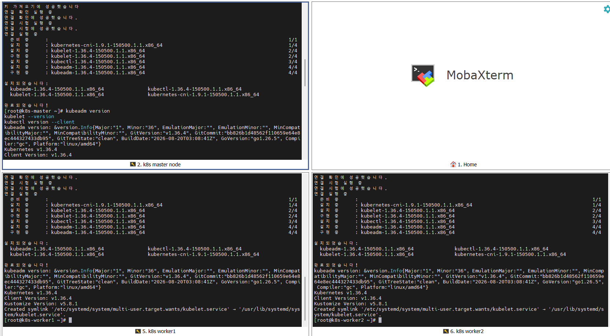
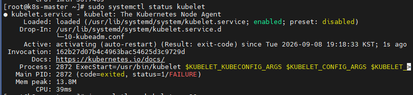

# 2026-09-08 — Day 05 (Phase 1)

## 오늘 목표
- kubeadm, kubelet, kubectl 설치 (버전 고정)
- runbook/cluster-bootstrap.md 초안 시작

## 오늘 한 일
- Kubernetes 지원 버전(1.35/1.36/1.37) 비교 후 v1.36 라인 선택
- pkgs.k8s.io stable/v1.36 저장소를 3대(master/worker1/worker2) 전부에 등록
- `dnf install kubelet kubeadm kubectl --disableexcludes=kubernetes`로 설치
- `kubeadm version` / `kubelet --version` / `kubectl version --client`로 3대 버전 통일 확인 (전부 v1.36.4)
- `systemctl enable --now kubelet` 실행 후 상태 확인
- `journalctl -u kubelet`로 crashloop 원인 로그 확인

## 왜 이 설정/방법을 선택했는가
| 항목 | 선택한 것 | 대안 | 선택 이유 |
|------|-----------|------|-----------|
| K8s 버전 | v1.36 (pkgs.k8s.io stable/v1.36) | v1.37(최신), v1.35(구버전) | 1.37은 릴리즈 2주밖에 안 돼 이슈 사례 부족, 1.35는 패치 지원 종료 임박 → 5개월차로 안정화된 1.36이 학습 용도에 적합 |
| repo exclude 설정 | repo 파일에 exclude 걸고, 설치 시에만 `--disableexcludes` 해제 | exclude 없이 설치 | 이후 `dnf update`로 의도치 않게 버전 스큐가 깨지는 사고 방지 |

## 오늘 처음 안 사실
| 몰랐던 것 | 알게 된 것 | 왜 그렇게 되는지 |
|-----------|-----------|----------------|
| kubelet 패키지만 설치하면 바로 정상 기동될 줄 알았음 | 설치 직후엔 crashloop이 "정상" 상태 | `/var/lib/kubelet/config.yaml`, `/etc/kubernetes/kubelet.conf`, `kubeadm-flags.env`는 패키지 설치가 아니라 `kubeadm init`/`join`이 생성 — 그전엔 kubelet이 자기 설정을 못 읽어서 exit 1 반복 |

## 검증 결과
```bash
# 3대 전부 동일
$ kubeadm version --output short   # v1.36.4
$ kubelet --version                # Kubernetes v1.36.4
$ kubectl version --client         # Client Version: v1.36.4

$ systemctl status kubelet
# Active: activating (auto-restart) (Result: exit-code)

$ journalctl -u kubelet -n 20 --no-pager
# E... "failed to load kubelet config file ... /var/lib/kubelet/config.yaml: no such file or directory"
```

## 결과·증거



## 막힌 점
- 없음
