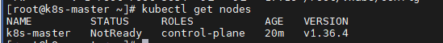
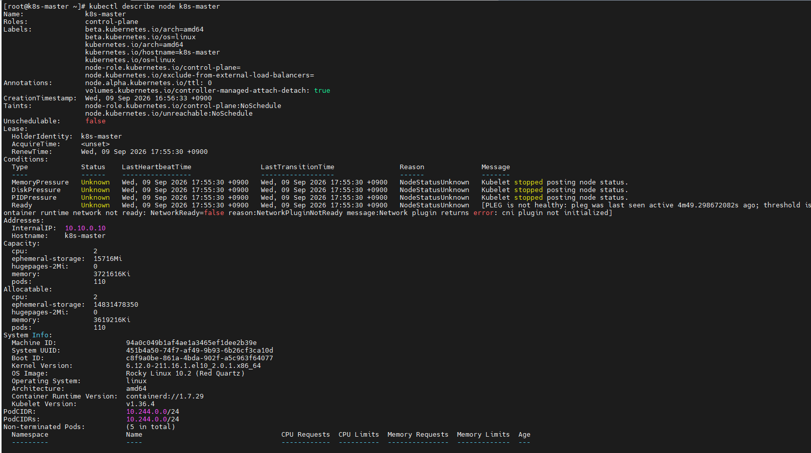
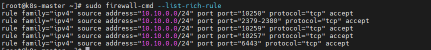

# 2026-09-09 — Day 06 (Phase 2)

## 오늘 목표
- 마스터에서 `kubeadm init` 실행 (Pod CIDR 사전 설계) — 초기화 로그 확인
- Phase 2 완료 기준(`kubectl get nodes` 전부 Ready)의 첫 단계: 컨트롤플레인 부트스트랩

## 오늘 한 일
- `kubeadm init` 사전 준비: 마스터/워커1/워커2 `/etc/hosts`에 Internal IP 기준 호스트명 등록 (`10.10.0.10 k8s-master` 등)
- firewalld rich rule로 Internal 대역(`10.10.0.0/24`)에서 오는 트래픽만 K8s 필수 포트 허용
  - 마스터: `6443`(API 서버), `2379-2380`(etcd), `10250`(kubelet API), `10259`(scheduler), `10257`(controller-manager)
  - 워커: `10250`(kubelet API)
- `sudo kubeadm init --apiserver-advertise-address=10.10.0.10 --pod-network-cidr=10.244.0.0/16` 실행 → 성공
- `$HOME/.kube/config`에 `admin.conf` 복사해 `kubectl` 로컬 연결
- `kubectl get nodes`로 baseline 확인 (`NotReady`) — 예상된 결과
- `kubectl describe node`로 `NotReady` 사유 확인 → `NetworkPluginNotReady` 등 3개 메시지가 CNI 부재라는 한 가지 원인의 연쇄 증상임을 확인
- `systemctl status containerd` / `journalctl -u containerd`로 컨테이너 런타임 자체는 정상 기동 중임을 검증 (재시작/에러 없음)
- `kubeadm join` 명령어 확보 (Day7 워커 join용, 토큰 24시간 유효)

## 왜 이 설정/방법을 선택했는가
| 항목 | 선택한 것 | 대안 | 선택 이유 |
|------|-----------|------|-----------|
| API 서버 advertise-address | Internal `10.10.0.10` | Host-only `172.25.250.10` | Host-only=관리자 SSH 접속용(public subnet 개념), Internal=클러스터 통신 전용(private subnet 개념)으로 이미 설계함(decisions/0001). 컨트롤플레인 통신도 클러스터 내부 트래픽이므로 Internal이 설계 의도와 일치 |
| firewalld 규칙 방식 | source 제한 rich rule (`10.10.0.0/24`만 허용) | `--add-port`로 전체 오픈 | 전체 오픈하면 관리망(Host-only)에서도 API 서버에 접근 가능해져 망 분리 설계가 무의미해짐. source 제한으로 관리망/클러스터망 분리 유지 |
| Pod CIDR | 기본값 `10.244.0.0/16` (Flannel 기본값) | 커스텀 대역 | 기존 사용 중인 Host-only(`172.25.250.0/24`), Internal(`10.10.0.0/24`) 대역과 겹치지 않음을 사전 확인 |

## 참고 — firewalld 포트 정리 (필수 vs 참고용)

**필수로 알아야 하는 것** (면접/문서에서 바로 설명 가능해야 함)

| 포트 | 용도 |
|---|---|
| `6443` | API 서버 포트. 클러스터 전체 통신(워커 join, kubectl, 노드 상태 보고)이 여기로 모임 — "클러스터의 정문" |
| `10250` | kubelet API 포트. 마스터/워커 **전 노드 공통**으로 필요한 유일한 포트 |

**구조적으로 이해해야 하는 것**: 컨트롤플레인 컴포넌트(API서버/etcd/scheduler/controller-manager)는 **마스터에만 존재**하므로 마스터만 해당 포트들을 열면 됨. 워커는 kubelet 하나뿐이라 `10250`만 필요 — 그래서 마스터/워커의 firewalld 규칙 세트가 다름.

**참고용** (필요할 때 찾아보면 됨, 번호까지 외울 필요는 없음)

| 포트 | 용도 |
|---|---|
| `2379-2380` | etcd 클라이언트/피어 통신 포트 (마스터 전용) |
| `10259` | kube-scheduler 헬스체크/메트릭 (마스터 전용) |
| `10257` | kube-controller-manager 헬스체크/메트릭 (마스터 전용) |

## 오늘 처음 안 사실
| 몰랐던 것 | 알게 된 것 | 왜 그렇게 되는지 |
|-----------|-----------|----------------|
| kubeadm/kubelet/kubectl 중 상시 데몬이 뭔지 | kubelet만 systemd 서비스로 상시 실행. kubeadm은 init/join/upgrade 시에만 실행, kubectl은 클라이언트 CLI일 뿐 | 컨트롤플레인 컴포넌트(etcd/apiserver/scheduler/controller-manager)도 static pod로 kubelet이 감시·재시작하는 구조라, 결국 모든 노드의 핵심은 kubelet |
| `NotReady`의 실제 메시지 구성 | `container runtime is down` / `PLEG is not healthy` / `NetworkPluginNotReady` 3개가 사실 CNI 부재라는 하나의 원인에서 나온 연쇄 증상 | CNI가 없어 Pod 네트워크 셋업 재시도가 반복되며 kubelet의 relist(PLEG) 루프가 밀려서 여러 증상으로 함께 보고됨. containerd 자체 로그엔 에러/재시작 흔적이 없어 런타임 자체 문제는 아님을 확인 |
| `kubeadm join`의 토큰 역할 | `--token`은 워커가 자신을 인증하는 값(Token ID.Secret 구조), `--discovery-token-ca-cert-hash`는 반대로 워커가 마스터(CA)를 검증하는 값. 기본 24시간 후 만료 | 매니지드 서비스(EKS)의 IAM 기반 노드 인증을 대신하는, kubeadm 자체의 임시 공유 비밀키 방식이기 때문 |

## 검증 결과
```bash
$ kubectl get nodes
NAME         STATUS     ROLES           AGE   VERSION
k8s-master   NotReady   control-plane   20m   v1.36.4

$ kubectl describe node k8s-master
...
Ready   False   ...   KubeletNotReady   [container runtime is down, PLEG is not healthy: pleg was
last seen active 14m2s ago; threshold is 3m0s, container runtime network not ready:
NetworkReady=false reason:NetworkPluginNotReady message:Network plugin returns error:
cni plugin not initialized]

$ sudo systemctl status containerd
Active: active (running) since ... 59min ago   # 재시작 없음, 5개 static pod 전부 StartContainer 성공

$ sudo firewall-cmd --list-rich-rules   # 마스터/워커1/워커2 전부 적용 확인 (success)

$ kubeadm token create --print-join-command
kubeadm join 10.10.0.10:6443 --token <REDACTED> --discovery-token-ca-cert-hash sha256:<REDACTED>
```

> 참고: 실제 토큰 값은 24시간 후 만료되지만, 공개 레포에 커밋하는 습관을 들이지 않기 위해 diary/runbook에는 위처럼 마스킹해서 남기고, 실제 값은 필요할 때 `kubeadm token create --print-join-command`로 그때그때 재발급해서 씁니다.

## 결과·증거

**1. `kubectl get nodes` — NotReady baseline**
`kubeadm init` 직후 노드 상태. CNI 미설치라 NotReady인 게 정상 (내일 Flannel 설치 후 Ready로 바뀌는 것과 비교할 기준점).


**2. `kubectl describe node` — NotReady 원인**
Conditions의 Ready 항목에서 `NetworkPluginNotReady` 메시지 확인. container runtime is down / PLEG not healthy도 같이 뜨지만 근본 원인은 CNI 미설치 하나임.


**3. firewalld rich rule 적용 확인 (3대)**
마스터/워커1/워커2 각각 `list-rich-rules` 결과, Internal 대역(10.10.0.0/24) 제한 규칙이 정상 등록됨.


## 막힌 점
- 없음
