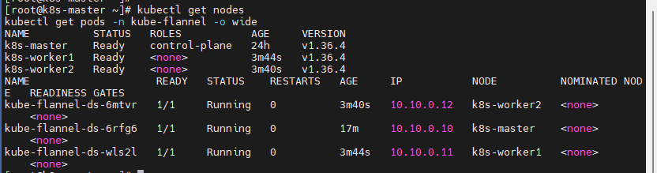

# 2026-09-10 — Day 07 (Phase 2)

## 오늘 목표
- Flannel(CNI) 설치로 마스터 Ready 전환
- 워커 2대 kubeadm join
- kubectl get nodes 전 노드 Ready 확인 + baseline evidence 캡처

## 오늘 한 일
- 마스터에 Flannel 설치 파일을 인터넷에서 받아 그대로 적용함. Day6에 정해둔 Pod IP 범위(10.244.0.0/16)와 Flannel의 기본 IP 범위가 같아서, 파일을 고칠 필요 없이 바로 설치됨
- Flannel Init 단계 거쳐 마스터 NotReady → Ready 전환 확인
- 워커 join용 토큰이 Day 6 발급분(24h TTL) 만료 임박(TTL 2m)한 것을 `kubeadm token list`로 확인 → `kubeadm token create --print-join-command`로 재발급
- 워커1, 워커2에서 각각 `kubeadm join` 실행 → 두 노드 모두 Ready 전환, flannel pod 3개(마스터+워커2) 전부 1/1 Running 확인

## 왜 이 설정/방법을 선택했는가
| 항목 | 선택한 것 | 대안 | 선택 이유 |
|------|-----------|------|-----------|
| join 순서 | 마스터 CNI 설치 → 워커 join | 워커 먼저 join 후 CNI 설치 | 마스터를 먼저 Ready로 만들어야 워커 join 시 정상적으로 붙는지 확인 가능 |
| join 토큰 | 재발급(`token create`) | 기존 Day6 토큰 재사용 시도 | TTL 24h 기본값 때문에 Day6 토큰이 거의 만료된 상태(TTL 2m)였음 |

## 오늘 처음 안 사실
| 몰랐던 것 | 알게 된 것 | 왜 그렇게 되는지 |
|-----------|-----------|----------------|
| kubectl apply -f (github URL)이 실제로 뭘 하는지 | GitHub는 YAML 설계도만 제공, 실제 flanneld 바이너리는 컨테이너 이미지(레지스트리)에서 pull됨 | DaemonSet 오브젝트가 만들어지면 K8s가 containerd에게 이미지 pull을 지시하는 구조이기 때문 |
| kubeadm join 토큰에 유효기간이 있다는 것 | 기본 TTL 24시간, 지나면 재발급 필요 | 토큰이 노출되면 누구나 클러스터에 노드를 끼워넣을 수 있어 보안상 임시값으로 설계됨 |

## 검증 결과
```bash
$ kubectl get nodes
NAME          STATUS   ROLES           AGE     VERSION
k8s-master    Ready    control-plane   24h     v1.36.4
k8s-worker1   Ready    <none>          3m44s   v1.36.4
k8s-worker2   Ready    <none>          3m40s   v1.36.4

$ kubectl get pods -n kube-flannel -o wide
NAME                    READY   STATUS    RESTARTS   AGE     IP           NODE          NOMINATED NODE   READINESS GATES
kube-flannel-ds-6mtvr   1/1     Running   0          3m40s   10.10.0.12   k8s-worker2   <none>           <none>
kube-flannel-ds-6rfg6   1/1     Running   0          17m     10.10.0.10   k8s-master    <none>           <none>
kube-flannel-ds-wls2l   1/1     Running   0          3m44s   10.10.0.11   k8s-worker1   <none>           <none>
```

## 결과·증거

Day 6에서 CNI 미설치로 NotReady였던 마스터가 Flannel 설치 후 Ready로 전환되고, 워커 2대 join까지 마쳐 3노드 전부 Ready + flannel pod 3개 전부 1/1 Running인 상태 — Phase 2 완료 시점의 baseline으로, 이후 Phase 5 장애 재현 시 "정상 상태" 비교 기준이 됨.

## 막힌 점
- Day6 발급 join 토큰이 24h TTL로 만료 임박 상태였음 → 재발급으로 해결

