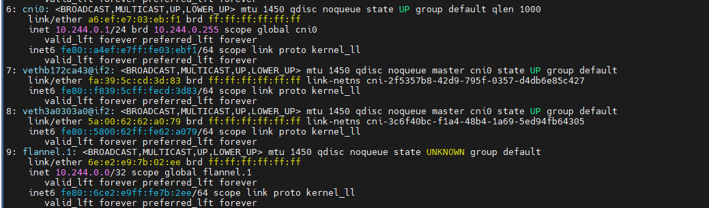
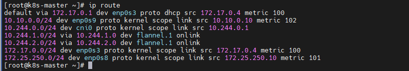
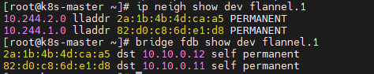

# 2026-09-13 — Day 08 (Phase 3)

## 오늘 목표
- Flannel VXLAN 인터페이스(`flannel.1`) 확인, `ip route`로 실제 라우팅 경로 추적 (Phase 3 진입 첫날)

## 오늘 한 일
- `ip a`로 flannel.1(VXLAN)/cni0(브리지)/veth 구조 확인
- `ip route`로 로컬 Pod 대역(cni0 경유)과 원격 노드 대역(flannel.1 경유) 라우팅 분기 확인
- `ip neigh` + `bridge fdb`로 "가짜 게이트웨이 → ARP → FDB → 실제 노드 IP" 숨은 매핑 원리 확인
- 위 과정에서 Flannel이 NAT망(172.17.x)을 잘못 타고 있는 걸 발견 → `kubectl patch`로 `--iface=enp0s9` 추가해 Internal망으로 수정 완료 (decisions/0005)
- 조사 도중 발생한 커널 soft lockup + 노드 전체 NotReady 장애 대응 (INC-001)

## 왜 이 설정/방법을 선택했는가
| 항목 | 선택한 것 | 대안 | 선택 이유 |
|---|---|---|---|
| Flannel 인터페이스 지정 | `--iface=enp0s9` (kubectl patch) | `kubectl edit`으로 수동 YAML 편집 | edit은 YAML 들여쓰기 오류로 실패, patch는 JSON 배열 append라 들여쓰기 실수 여지 없음 |

## 오늘 처음 안 사실
| 몰랐던 것 | 알게 된 것 | 왜 그렇게 되는지 |
|---|---|---|
| flannel.1 MTU가 1450인 이유 | VXLAN 캡슐화 오버헤드(50바이트)를 미리 뺀 값 | 1500(물리 MTU) − 50(캡슐화 헤더) = 1450 |
| `via X dev flannel.1 onlink` 라우팅 의미 | 실제 게이트웨이가 아니라 ARP+FDB로 진짜 목적지를 찾는 트리거용 가짜 주소 | flanneld가 미리 ARP/FDB 테이블을 조작해둠 |
| kubelet InternalIP ≠ Flannel public-ip 결정 로직 | kubelet은 명시적 설정(advertise-address)을 따르지만 Flannel은 기본 경로 기준 자동 탐지 | Day2에서 Host-only/Internal에 never-default를 걸어 NAT만 기본 경로를 가지게 된 것이 원인 |
| kubelet 에러 5종(런타임다운/PLEG불량/lease실패/scheduler CrashLoop/housekeeping지연)이 사실 한 원인 | CPU 순간 정지(soft lockup) 하나가 여러 하위 기능을 동시에 멈추게 함 | kubelet housekeeping 지연 시각과 커널 soft lockup 시각이 정확히 일치 |
| Node AGE ≠ VM uptime | 서로 다른 시계(K8s 오브젝트 나이 vs 커널 부팅 이후 시간) | Node 오브젝트는 재부팅해도 etcd에 유지되지만 uptime은 커널 기준 리셋 |
| vmstat의 steal(st) | 호스트가 CPU를 안 줘서 못 쓴 시간 비율 | steal=0이면 최소한 그 순간은 호스트 탓이 아니라는 판단 근거가 됨 |

## 검증 결과
```bash
# flannel.1 확인
ip a
# → flannel.1 mtu 1450 확인

# 라우팅 분기 확인
ip route
# 10.244.0.0/24 dev cni0 (로컬)
# 10.244.1.0/24, 10.244.2.0/24 via ... dev flannel.1 onlink (원격)

# 숨은 매핑 확인 (여기서 NAT망 오류 최초 발견)
ip neigh show dev flannel.1
bridge fdb show dev flannel.1
# → dst가 172.17.x로 나옴

# 최종 확인 (수정 전)
kubectl get nodes -o jsonpath='{range .items[*]}{.metadata.name}{"\t"}{.metadata.annotations.flannel\.alpha\.coreos\.com/public-ip}{"\n"}{end}'
# k8s-master 172.17.0.4 / k8s-worker1 172.17.0.3 / k8s-worker2 172.17.0.5

# 수정
kubectl patch daemonset kube-flannel-ds -n kube-flannel --type='json' \
  -p='[{"op":"add","path":"/spec/template/spec/containers/0/args/-","value":"--iface=enp0s9"}]'

# 수정 후 확인
kubectl get nodes -o jsonpath='{range .items[*]}{.metadata.name}{"\t"}{.metadata.annotations.flannel\.alpha\.coreos\.com/public-ip}{"\n"}{end}'
# k8s-master 10.10.0.10 / k8s-worker1 10.10.0.11 / k8s-worker2 10.10.0.12  ✅
```

## 결과·증거

`flannel.1` 인터페이스가 MTU 1450으로 생성된 것을 확인. VXLAN 캡슐화 오버헤드(50바이트)를
미리 반영한 값으로, 실제 캡슐화가 이루어지고 있다는 근거.


같은 노드의 Pod 대역(10.244.0.0/24)은 `cni0` 브리지로, 다른 노드 대역(10.244.1.0/24,
10.244.2.0/24)은 `flannel.1`로 나가도록 라우팅 테이블이 분리되어 있음을 확인.


`via 10.244.x.0 dev flannel.1 onlink` 라우팅의 실제 동작 원리 확인 — 가짜 게이트웨이 IP를
ARP 테이블에서 MAC으로, 그 MAC을 FDB에서 실제 노드 IP로 변환하는 이중 매핑 구조를 확인.
(참고: 조사 당시엔 dst가 NAT망 172.17.x로 나왔으나, `--iface` 수정 후 재캡처하여
Internal망(10.10.x)으로 정상화된 상태가 찍혀 있음)

## 오늘의 질문/답변 모음

### 내가 던진 질문
| 질문 | 핵심 답변 요약 |
|---|---|
| CNI가 정확히 뭐였지? | 컨테이너에 네트워크(IP·인터페이스)를 붙여주는 방법에 대한 표준 규격 + 그 구현체(Flannel 등) |
| "Pod IP는 컨테이너 IP가 아니라 네트워크 네임스페이스의 IP"가 무슨 뜻? | 한 Pod 안 컨테이너들은 네트워크 네임스페이스 하나를 공유하므로 IP도 하나만 가짐 |
| namespace 등 기본 개념이 기억 안 남 | 리눅스 네임스페이스(커널 격리 기능) vs 쿠버네티스 네임스페이스(오브젝트 분류)는 완전히 다른 개념임을 재정리 |
| MTU가 뭔데? | 인터페이스가 한 번에 보낼 수 있는 패킷 최대 크기; flannel.1의 1450은 VXLAN 오버헤드 50바이트를 뺀 값 |
| 왜 NAT로 연결되었던거지? | Day2 never-default 설정 → NAT만 기본 경로 보유 → Flannel의 자동 인터페이스 선택 로직이 그걸 그대로 따름 |

### AI가 던진 질문
| 구분 | 질문 | 내 답변 |
|---|---|---|
| 전날 복습 | join 토큰이 정확히 뭘 인증하는 용도인가? | "master node 접속 위한 보안" (→ Bootstrap Token 개념으로 보완 설명 받음) |
| 전날 복습 | kubelet Ready 판정에 CNI가 왜 들어가는가? | "CNI가 없어서 음" (미완성 → 상세 설명으로 보완 받음) |
| INC-001 이해검증 | 4가지 에러가 왜 한 원인인가? | "cpu가 작동하지 않아서 발생한 오류인 것 같았기 때문" ✅ |
| INC-001 이해검증 | steal=0이 왜 호스트 탓 아님의 증거인가? | "cpu를 다른 프로그램에 빼앗긴 것은 아니기 때문" ✅ |
| INC-001 이해검증 | 다음에 같은 증상이면 어떻게 구분할 것인가? | "코어 개수/st 확인해서 진짜 부족한지 볼 것, 이번은 부팅시 발생하는 오류인듯" ✅ |

## 막힌 점
- `kubectl edit ds kube-flannel-ds` 시도 시 YAML 문법 오류로 편집 실패 → `kubectl patch --type=json`으로 우회 성공
- INC-001: 재부팅 직후 CPU soft lockup 반복 발생, "일시적 초기화 폭주"로 잠정 결론(호스트 8코어/VM 총 6vCPU로 상시 오버커밋 아님 확인). 재발 시 uptime + steal 확인해서 재판단 필요

