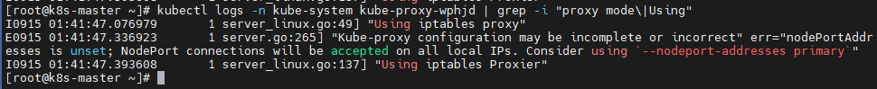
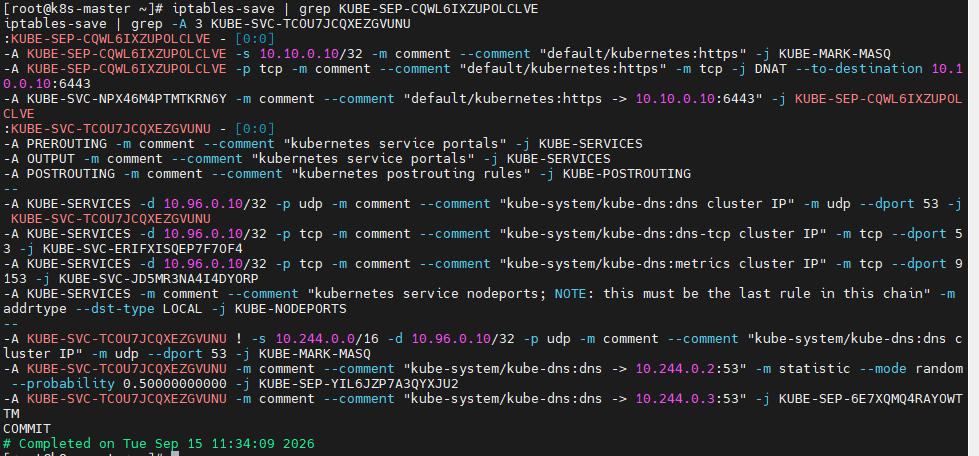

# 2026-09-15 — Day 09 (Phase 3)

## 오늘 목표
- kube-proxy가 실제로 어떤 모드(iptables/IPVS)로 동작 중인지 확인
- Service의 ClusterIP가 iptables 룰 체인을 거쳐 실제 Pod IP로 바뀌는 과정을 직접 추적

## 오늘 한 일
- `kubectl logs`로 kube-proxy 로그 확인 → "Using iptables proxy" / "Using iptables Proxier" 확인, iptables 모드로 정상 동작 중임을 확인
- 로그에 함께 뜬 `nodePortAddresses is unset` 경고의 의미 파악
- `kubernetes` 서비스(ClusterIP `10.96.0.1:443`, 백엔드 1개=apiserver)의 iptables 체인을 끝까지 추적: `KUBE-SERVICES` → `KUBE-SVC-NPX46M4PTMTKRN6Y` → `KUBE-SEP-CQWL6IXZUPOLCLVE` → 최종 `DNAT --to-destination 10.10.0.10:6443` 확인
- `kube-dns` 서비스(ClusterIP `10.96.0.10:53`, 백엔드 2개=CoreDNS 파드 2개)의 로드밸런싱 룰 확인 — `-m statistic --mode random --probability 0.5` 방식의 순차 확률 매칭으로 두 파드에 트래픽 분배 확인
- `KUBE-NODEPORTS` 체인 baseline 확인 (아직 비어있음, Day 10 전후 비교용)

## 오늘 궁금해서 물어본 질문
| 질문 | 답변 요지 |
|---|---|
| NodePort가 관리망/클러스터망 구분 없이 열리는 이유는? | iptables 매치 조건이 특정 인터페이스가 아니라 `--dst-type LOCAL`(노드가 가진 모든 주소)이라서 |
| kube-proxy의 DNAT 구조가 Flannel의 ARP/FDB 구조랑 비슷한 개념인가? | 철학(가짜 주소로 실체를 숨김)은 같지만, Flannel은 L2 프레임 생성 문제 때문에 3단계, kube-proxy는 라우팅 전 주소만 1단계로 바꿔치기하는 훨씬 단순한 구조 |
| Service의 ClusterIP→Pod IP 변환이 정확히 무슨 뜻인가? | ClusterIP는 실체 없는 가짜 주소이고, 그 주소로 오는 패킷의 목적지를 커널이 iptables 룰로 몰래 바꿔치기(DNAT)해서 진짜 Pod한테 도달시키는 것 |


## 오늘 처음 안 사실
| 몰랐던 것 | 알게 된 것 | 왜 그렇게 되는지 |
|-----------|-----------|----------------|
| ClusterIP가 Pod IP로 바뀌는 실제 메커니즘 | `KUBE-SERVICES`→`KUBE-SVC-xxx`→`KUBE-SEP-xxx` 3단 체인을 거쳐 마지막 한 곳에서만 DNAT 발생 | 서비스별/백엔드별로 룰을 분리 관리하기 위해 계층화된 체인 구조로 설계됨 |
| 백엔드가 여러 개일 때 로드밸런싱 방식 | `-m statistic --mode random --probability` 룰을 순서대로 쌓아서 확률적으로 분배 | iptables 자체엔 로드밸런서 로직이 없고 확률 매칭으로 흉내 낸 것 → 백엔드 많아지면 룰도 늘어나 성능 저하 |

## 오늘 이해한 핵심 원리

### 왜 체인이 3단계로 나뉘었나 (KUBE-SERVICES → KUBE-SVC → KUBE-SEP)
한 줄로 "10.96.0.1이면 진짜 IP로 바꿔라"만 해도 되는데, 왜 3단계로 나눴을까 — 서비스도 여러 개, 백엔드도 여러 개라 정리가 필요해서다.

1. `KUBE-SERVICES`: "너 어떤 서비스야?" (10.96.0.1인지 10.96.0.10인지 구분)
2. `KUBE-SVC-xxx`: "그 서비스 백엔드가 몇 개인지, 그중 뭘 고를지" 구간
3. `KUBE-SEP-xxx`: "고른 그 백엔드로 진짜 바꿔치기"

비유하면 폴더 정리다. 파일 하나 찾을 때 "학교 폴더 → 2학년 폴더 → 수학.pdf"처럼 나눠놓은 것과 같다. 서비스가 몇 개 안 되면 안 나눠도 되지만, 클러스터에 서비스가 수십~수백 개 있으면 이렇게 계층을 나눠야 관리가 된다.

### 로드밸런싱은 왜 확률로 하나
이것도 결국 "바꿔치기할 후보가 2개 이상일 때 뭘 고르냐"의 문제다. kube-dns는 파드가 2개라서:

- "50% 확률로 걸리면 파드1로"
- "안 걸리면(=나머지 전부) 파드2로"

동전 던지듯 나눠놓은 것뿐이다. 진짜 로드밸런서 로직이 있는 게 아니라 확률 룰을 순서대로 쌓아서 흉내 낸 것이다.

## 검증 결과
```bash
$ kubectl logs -n kube-system kube-proxy-wphjd | grep -i "proxy mode\|Using"
I0915 ... "Using iptables proxy"
I0915 ... "Using iptables Proxier"

$ iptables-save | grep KUBE-SEP-CQWL6IXZUPOLCLVE
-A KUBE-SEP-CQWL6IXZUPOLCLVE -p tcp -j DNAT --to-destination 10.10.0.10:6443

$ iptables-save | grep -A 3 KUBE-SVC-TCOU7JCQXEZGVUNU
... --probability 0.5 -j KUBE-SEP-YIL6JZP7A3QYXJU2
... -j KUBE-SEP-6E7XQMQ4RAYOWTTM

$ kubectl get nodes
k8s-master   NotReady → (복구 후 Ready)
$ uptime
load average: 9.04, 3.36, 3.14 (부팅 36분 후)
```

## 결과·증거

*kube-proxy 로그에서 "Using iptables Proxier" 확인 — iptables 모드로 동작 중임을 보여줌*


*ClusterIP를 실제 Pod IP로 바꾸는 DNAT 규칙과, 백엔드 2개일 때 확률 기반으로 분배되는 로드밸런싱 규칙을 함께 확인*

## 막힌 점
- 없음
