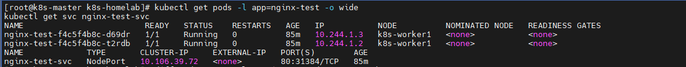
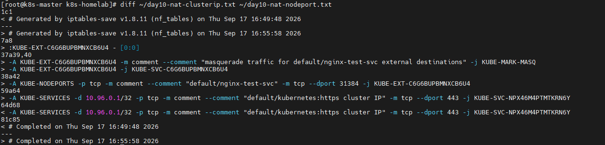

# 2026-09-17 — Day 10 (Phase 3)

## 오늘 목표
- Service 실습: ClusterIP → NodePort로 바꾸면서 각 단계에서 iptables 룰이 어떻게 변하는지 직접 확인

## 오늘 한 일
- `phase3-network/nginx-clusterip.yaml`로 nginx-test Deployment(replica 2) + nginx-test-svc(ClusterIP) 배포 — Pod 2개 모두 worker1에 배치(10.244.1.2, 10.244.1.3)
- `iptables-save -t nat`로 baseline 캡처 후 `KUBE-SERVICES → KUBE-SVC-C6G6BUPBMNXCB6U4 → KUBE-SEP-O4DH…/KUBE-SEP-DRL6…` 체인을 직접 추적, `--to-destination`이 실제 Pod IP와 일치함을 확인
- **(예상 못한 장애)** NodePort/Pod IP 직접 접속 모두 실패 → 마스터↔worker1 간 Pod 통신 자체가 안 되는 문제 발견, 원인 분석 후 복구 (아래 "막힌 점" 및 INC-002 참고)
- Windows 호스트(Host-only망)에서 `curl 172.25.250.10:31384` 외부 접속 성공 확인
- INC-002 문서 작성

## 왜 이 설정/방법을 선택했는가
| 항목 | 선택한 것 | 대안 | 선택 이유 |
|------|-----------|------|-----------|
| 테스트 워크로드 | nginx, replica 2 | replica 1 / 다른 이미지 | 설정 없이 즉시 응답, replica 2라야 SVC→SEP 확률 분산(`--probability`)을 실제로 볼 수 있음 |
| VXLAN 포트 방화벽 규칙 | rich rule (source 10.10.0.0/24, 8472/udp) | 8472/udp 전체 오픈 | Day 1 설계(Internal망 = 클러스터 통신 전용) 유지, 소스 제한 원칙 그대로 |
| cni0/flannel.1 zone 처리 | trusted zone으로 이동 | public zone에 세부 allow 규칙 추가 | Pod 내부망 트래픽까지 호스트 방화벽이 세밀하게 막을 필요는 없다고 판단, 세밀한 통제는 NetworkPolicy 몫으로 분리 |

## 오늘 처음 안 사실
| 몰랐던 것 | 알게 된 것 | 왜 그렇게 되는지 |
|-----------|-----------|----------------|
| kube-proxy 로드밸런싱 구현 | `-m statistic --mode random --probability`로 조건부 확률 분산 | iptables는 순차 매칭이라 "N개 중 하나 선택"이 없음 → k번째 규칙 확률 1/(N-k+1)로 역산해서 균등분배 흉내 |
| Flannel VXLAN 포트 | UDP 8472, 노드 간 필수 | Day 6 firewalld 설계 시 컨트롤플레인 포트만 챙기고 CNI 오버레이 포트를 놓침 |
| br_netfilter의 영향 | 브리지(cni0) 트래픽도 firewalld 검사 대상이 됨 | cni0/flannel.1이 zone 미지정 상태면 기본 zone(public)의 제한 정책이 그대로 적용됨 |
| DNAT와 라우팅 결정의 순서 | DNAT(PREROUTING)가 라우팅 결정보다 먼저 일어남 | NodePort 트래픽은 목적지가 Pod IP로 바뀐 뒤 판정되므로 INPUT이 아니라 FORWARD로 취급됨 → Host-only 소스 제한이 안 먹힘 |

## 오늘 질문한 것들 (Q&A)

| 질문 | 요약 답변 |
|------|-----------|
| 테스트용 Deployment/Service를 왜 만드나 | 지금 클러스터엔 관찰할 우리 Service가 없어서, iptables 룰 변화를 비교할 대상 자체를 직접 만들어야 했다 |
| grep으로 체인 추적하는 게 뭘 하는 거냐 | ClusterIP로 들어온 요청이 실제로 어느 Pod IP로 바뀌는지, 그 경로(SERVICES→SVC→SEP)를 iptables 규칙에서 눈으로 따라가 보는 것 |
| 이거 Day 9에 이미 확인한 거 아니냐 | 맞음 — 체인 추적 "방법"은 Day 9 복습. 오늘 새로운 건 우리 서비스로 직접 해보고, 이걸 ClusterIP→NodePort 비교의 baseline으로 쓴 것 |
| ClusterIP랑 NodePort 차이가 뭐냐 | ClusterIP는 클러스터 내부 전용 가상 IP, NodePort는 모든 노드의 실제 IP에 포트를 열어 외부 접근을 가능하게 함(NodePort가 ClusterIP를 포함하는 상위호환) |
| nginx-test-svc만 NodePort로 바뀐 거 맞냐 | 맞음 — kube-system의 다른 서비스들은 손대지 않아 여전히 ClusterIP 그대로 |
| Host-only로 망을 나눈 의미가 없어지는 거 아니냐 | 아니다 — 컨트롤플레인 포트(6443 등)는 여전히 Internal 전용으로 보호됨. NodePort로 일부러 노출한 서비스만 예외이고, 그건 애초에 그 분리 규칙의 적용 대상이 아니었을 뿐 |

## 검증 결과
```bash
# ClusterIP → NodePort 변화 확인
diff ~/day10-nat-clusterip.txt ~/day10-nat-nodeport.txt
# > KUBE-EXT-C6G6BUPBMNXCB6U4 (신규), KUBE-NODEPORTS --dport 31384 (신규)

# 장애 복구 후 검증
ping -c 3 10.244.1.2
# 3 패킷 전송, 3 수신, 0% packet loss

curl -m 5 10.244.1.2:80
# Welcome to nginx! 정상 수신

# 외부(Windows, Host-only망) 접속 검증
curl -m 5 http://172.25.250.10:31384
# Welcome to nginx! 정상 수신
```

## 결과·증거

→ Service TYPE이 NodePort이고 PORT(S)에 31384가 붙어있는지 확인

→ ClusterIP 때는 없었는데 NodePort로 바꾸면서 새로 생긴 iptables 룰(KUBE-EXT, KUBE-NODEPORTS)을 그대로 다시 보여주는 명령

- 장애/복구 관련 증거는 `incidents/INC-002.md` 참고

## 막힌 점
- 예상치 못하게 마스터↔worker1 간 Pod 통신 자체가 두절되어 있었음 — VXLAN 포트(8472/udp) 미허용 + cni0/flannel.1 zone 미지정 두 가지가 겹쳐 있었음. INC-002로 별도 문서화, worker1·worker2·마스터에 동일 조치 적용
- 마스터의 trusted zone 적용 결과는 안내만 하고 실제 확인은 아직 못함 (다음 세션에서 `firewall-cmd --get-active-zones`로 확인 필요)

