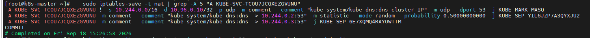
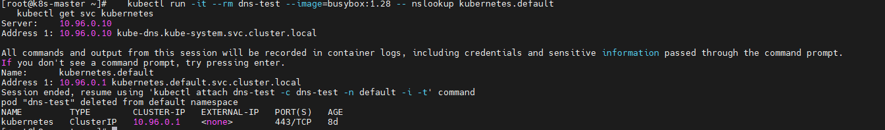

# 2026-09-18 — Day 11 (Phase 3)

## 오늘 목표
- CoreDNS가 서비스 이름(예: kubernetes.default)을 어떻게 ClusterIP로 변환하는지, 실제 경로를 추적한다

## 오늘 한 일
- Day 10 복습: NodePort 체인 구조(KUBE-EXT/KUBE-NODEPORTS), DNAT가 INPUT이 아니라 FORWARD 체인을 타는 원리 재확인
- CoreDNS Pod 상태 확인 (`kubectl get pods -n kube-system -l k8s-app=kube-dns`) — replica 2개, 둘 다 마스터 노드에 스케줄링된 것 확인
- 테스트 Pod의 `/etc/resolv.conf` 확인 → `nameserver 10.96.0.10` 확인
- `kube-dns` Service 확인 → 10.96.0.10 = kube-dns의 ClusterIP와 일치 확인
- iptables NAT 테이블에서 10.96.0.10 → `KUBE-SVC-TCOU7JCQXEZGVUNU` → 50/50 확률로 `KUBE-SEP-YIL6JZP7A3QYXJU2`(10.244.0.2:53) / `KUBE-SEP-6E7XQMQ4RAYOWTTM`(10.244.0.3:53)로 분산되는 체인 확인
- `nslookup kubernetes.default` 실행 → `10.96.0.1` 응답 확인
- `kubectl get svc kubernetes` → CLUSTER-IP `10.96.0.1`과 일치 확인

## 왜 이 설정/방법을 선택했는가
| 항목 | 선택한 것 | 대안 | 선택 이유 |
|------|-----------|------|-----------|
| DNS 추적 순서 | resolv.conf → kube-dns Service → iptables → nslookup → Corefile 순으로 역추적 | Corefile부터 바로 확인 | Pod가 실제로 겪는 순서 그대로 따라가야 "왜 이렇게 동작하는지"를 체감할 수 있음 |
| 테스트 도구 | `busybox:1.28` + `nslookup` | `dig`, `curl` 등 | 가볍고 K8s 공식 문서 예시와 동일해서 비교하기 쉬움 |

## 오늘 처음 안 사실
| 몰랐던 것 | 알게 된 것 | 왜 그렇게 되는지 |
|-----------|-----------|----------------|
| CoreDNS가 이름→IP를 어떻게 아는지 | 정적 zone 파일이 아니라, Corefile의 `kubernetes` 플러그인이 K8s API를 실시간 watch해서 응답을 만든다 | Service가 생성/삭제될 때마다 etcd 변경이 API 서버를 통해 즉시 CoreDNS에 반영됨. 사람이 DNS 레코드를 직접 등록할 필요 없음 |
| kube-dns Service의 ClusterIP도 "가짜 주소" | 10.96.0.10은 실체가 없고, iptables SVC/SEP 체인이 실제 CoreDNS Pod(10.244.0.2/.3)로 연결해줌 | ClusterIP 타입 Service는 전부 동일한 iptables 메커니즘을 씀 — kube-dns도 예외 아님 |

## 검증 결과
```bash
# resolv.conf 확인
$ kubectl run -it --rm dns-test --image=busybox:1.28 -- cat /etc/resolv.conf
nameserver 10.96.0.10
search default.svc.cluster.local svc.cluster.local cluster.local dja.kr
options ndots:5

# kube-dns Service 확인
$ kubectl get svc -n kube-system kube-dns
NAME       TYPE        CLUSTER-IP   EXTERNAL-IP   PORT(S)                  AGE
kube-dns   ClusterIP   10.96.0.10   <none>        53/UDP,53/TCP,9153/TCP   8d

# iptables SVC->SEP 체인 (UDP DNS)
$ sudo iptables-save -t nat | grep -A 5 "A KUBE-SVC-TCOU7JCQXEZGVUNU"
-A KUBE-SVC-TCOU7JCQXEZGVUNU ! -s 10.244.0.0/16 -d 10.96.0.10/32 -p udp --dport 53 -j KUBE-MARK-MASQ
-A KUBE-SVC-TCOU7JCQXEZGVUNU --probability 0.50000000000 -j KUBE-SEP-YIL6JZP7A3QYXJU2   # -> 10.244.0.2:53
-A KUBE-SVC-TCOU7JCQXEZGVUNU -j KUBE-SEP-6E7XQMQ4RAYOWTTM                                # -> 10.244.0.3:53

# 실제 이름 조회
$ kubectl run -it --rm dns-test --image=busybox:1.28 -- nslookup kubernetes.default
Server:    10.96.0.10
Name:      kubernetes.default
Address 1: 10.96.0.1 kubernetes.default.svc.cluster.local

# 검증: kubernetes Service ClusterIP와 일치 확인
$ kubectl get svc kubernetes
NAME         TYPE        CLUSTER-IP   EXTERNAL-IP   PORT(S)   AGE
kubernetes   ClusterIP   10.96.0.1    <none>        443/TCP   8d
```

## 결과·증거

- 10.96.0.10(가짜 ClusterIP)이 iptables KUBE-SVC/KUBE-SEP 체인을 통해 실제 CoreDNS Pod IP(10.244.0.2, 10.244.0.3)로 분산 연결되는 걸 보여주는 캡처


- nslookup으로 kubernetes.default를 조회한 응답(10.96.0.1)이 실제 kubernetes Service의 CLUSTER-IP와 일치한다는, 오늘의 최종 결론을 보여주는 캡처

## 막힌 점
- CoreDNS Pod 2개가 전부 마스터에만 떠있는 이유 — kubeadm init 시점(워커 join 전)에 스케줄링돼서 그 이후로 리밸런싱이 안 된 것으로 추정. 
