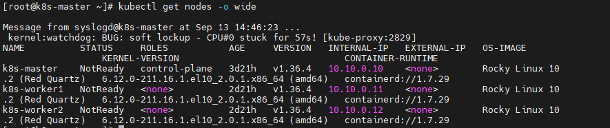
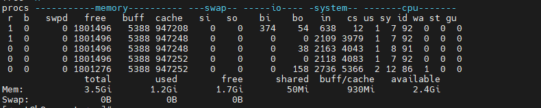
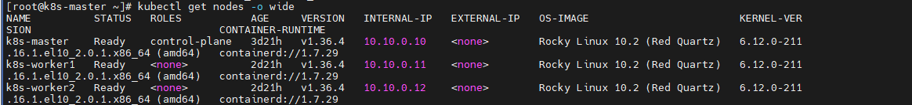

# INC-001: 마스터 노드 재부팅 직후 CPU 소프트락업으로 인한 클러스터 전체 NotReady

## Severity
P1 (노드 3대 동시 NotReady + API 서버 응답 지연 발생 — 컨트롤플레인 수준 불안정)

## Situation (상황)
Day 8 세션에서 Phase 3(Flannel VXLAN/라우팅 확인) 작업 중, 마스터 노드가 세션 시작 전
재부팅된 상태(uptime 37분, kubectl AGE는 3d21h로 별개)였음. kubectl 명령 실행 중
커널 watchdog 경고 메시지가 화면에 노출되며 문제 인지.

## Task (해결해야 했던 것)
- 노드 전원 상태(NotReady) 원인 파악
- 호스트 자원 부족(구조적 오버커밋)인지, 일시적 초기화 폭주인지 구분
- 클러스터 정상화 여부 확인

## Action (조치)
- `dmesg -T | grep -i "soft lockup"` → 30분 내 3회 발생 확인
  (14:16 containerd-shim, 14:44 kworker/containerd-shim, 14:46 kube-proxy, 각 36~57초)
- `journalctl -u kubelet -n 50` → 아래를 하나의 원인(CPU 순간 정지)의 연쇄 증상으로 판단:
- `kubectl get nodes -o wide` 재실행 → 3노드 전부 Ready로 자연 복귀 확인
- `uptime` / `free -h` → load average 5분/15분 ≈ 3.0 (2vCPU 대비 초과), 메모리는 여유 있음
- `vmstat 1 5` → steal(st) = 0, idle 86~92% → **현재 시점은** 호스트가 CPU를 못 준 상황 아님
- 호스트 스펙 확인: 물리 8코어 / VM 3대(각 2vCPU) 동시 구동 → 총 요구 6vCPU, 상시 오버커밋 아님

**재현 명령어**: 마스터 VM 재부팅 후 5~10분간 `dmesg -T | grep -i "soft lockup"`과
`kubectl get nodes -w`를 동시에 모니터링하면 재현 가능성 있음 (미확정, 다음 재부팅 시 검증 필요)

## Result (결과)
- 별도 수동 개입 없이 수십 분 내 자연 정상화, 데이터 유실 없음
- 새로 알게 된 것:
  - kubelet의 서로 다른 에러 메시지 4종이 실제로는 "CPU 순간 정지" 하나의 원인에서 나온 연쇄 증상
  - K8s Node의 AGE(오브젝트 나이)와 VM uptime(커널 부팅 이후 시간)은 서로 다른 시계
  - `vmstat`의 steal(st) 값으로 "호스트가 CPU를 안 줌" vs "게스트 내부가 바쁨"을 구분할 수 있음
  - 재부팅 직후는 컨트롤플레인+CNI+시스템 Pod가 동시 초기화되는 구간이라 평소보다 CPU 요구가 급증함

## Evidence

`kubectl get nodes` 실행 중 커널 watchdog soft lockup 경고가 함께 출력되며, 마스터·워커1·
워커2 전 노드가 NotReady 상태였음을 확인.

30분 사이 soft lockup이 3회(containerd-shim, kworker, kube-proxy 프로세스) 발생한 것을
`dmesg`로 확인. 1회성이 아닌 반복 패턴이라는 근거.

`vmstat`의 steal(st) 값이 0으로 나와, 최소한 확인 시점 기준으로는 호스트가 CPU를 뺏어간
것이 아님을 확인. 호스트 물리 8코어 대비 VM 3대 총 6vCPU 요구로 상시 오버커밋 구조는
아니라고 판단.

별도 수동 조치 없이 수십 분 내 노드 3대 전부 Ready로 자연 복귀한 것을 확인.