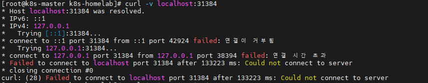

# INC-002: Flannel VXLAN(8472/udp) 및 브리지 포워딩 차단으로 인한 노드 간 Pod 통신 두절

## Severity

**P2** — 특정 노드 간 CNI 통신 장애 (Pod 간 통신만 두절, 클러스터 API/노드 상태 자체는 정상)

## Situation (상황)

Day 10, Service를 ClusterIP → NodePort로 전환하는 실습 중이었음. 클러스터는 3노드 모두 `Ready`, 컨트롤플레인 정상 동작 중이었고 nginx-test Deployment(replica 2, 모두 worker1에 배치)도 `1/1 Running` 상태였음. NodePort(31384)로 접속 테스트를 하려고 `curl localhost:31384`를 실행했으나 응답 없이 멈춤(최종 133초 후 타임아웃).

## Task (해결해야 했던 것)

1. 어느 레이어에서 막히는지 특정 (Service/NodePort 문제인지, 그보다 아래 레이어 문제인지)
2. 마스터 ↔ worker1 간 Pod-to-Pod 통신을 복구
3. 동일 문제가 다른 노드에도 잠재해 있는지 확인하고 예방 조치

## Action (조치)

### 1) 증상 재현 및 레이어 분리

```bash
# NodePort(localhost) 접속 시도 — hang 후 타임아웃
curl -v localhost:31384

# Service를 거치지 않고 Pod IP로 직접 접속 → 역시 실패 (Service 문제가 아님을 확인)
curl -m 5 10.244.1.2:80
# curl: (28) Connection timed out after 6440 milliseconds

ping -c 3 10.244.1.2
# 3 패킷이 전송됨, 0 수신됨, 100% packet loss
```

### 2) 라우팅 결정 자체는 정상임을 확인

```bash
ip route get 10.244.1.2
# 10.244.1.2 via 10.244.1.0 dev flannel.1 src 10.244.0.0
```

→ 마스터의 라우팅 결정(flannel.1 경유)은 정상. 그 다음 단계(캡슐화 → 워커1 도착 → 디캡슐화 → 브리지 전달)에서 막히고 있다고 판단.

### 3) 1차 원인 확인 및 조치 — VXLAN 포트(8472/udp) 미허용

```bash
# worker1에서 확인
ip -d link show flannel.1
# vxlan id 1 local 10.10.0.11 dev enp0s9 srcport 0 0 dstport 8472 ...

sudo firewall-cmd --list-all
# rich rules: source=10.10.0.0/24 port=10250/tcp accept 만 존재, 8472/udp 없음
```

→ Day 6에 firewalld를 설계할 때 K8s 컨트롤플레인 포트(6443, 2379-2380, 10250, 10259, 10257)만 허용했고, **Flannel의 노드 간 VXLAN 캡슐화 트래픽(UDP 8472)이 허용 목록에서 누락**되어 있었음. 

```bash
# 마스터, worker1 양쪽에 적용 (VXLAN은 양방향 통신이므로 양쪽 다 필요)
sudo firewall-cmd --permanent --zone=public --add-rich-rule='rule family="ipv4" source address="10.10.0.0/24" port port="8472" protocol="udp" accept'
sudo firewall-cmd --reload
```

→ 재현 시 증상이 "무응답 타임아웃"에서 `10.244.1.0에서 icmp_seq=1 패킷이 필터링됨`(명시적 거부)으로 바뀜. VXLAN 통로 자체는 열렸으나 다음 단계에서 여전히 막힘을 시사.

### 4) 2차 원인 확인 및 조치 — 브리지(cni0) 포워딩 차단

Day 3에 `br_netfilter` 커널 모듈을 활성화해 브리지 트래픽도 iptables/firewalld 검사 대상이 되도록 했는데, `cni0`/`flannel.1` 인터페이스가 어느 zone에도 명시적으로 속하지 않아 기본 zone(`public`)의 제한적인 정책이 적용되고 있었음. 디캡슐화된 패킷이 `flannel.1`에서 `cni0` 브리지로 넘어가는(FORWARD) 지점에서 거부됨.

```bash
# worker1, worker2, 마스터 모두 적용
sudo firewall-cmd --zone=trusted --change-interface=cni0 --permanent
sudo firewall-cmd --zone=trusted --change-interface=flannel.1 --permanent
sudo firewall-cmd --reload
```

### 재현 명령어

```bash
# 원상복구(장애 재현)하려면
sudo firewall-cmd --permanent --zone=public --remove-rich-rule='rule family="ipv4" source address="10.10.0.0/24" port port="8472" protocol="udp" accept'
sudo firewall-cmd --zone=trusted --change-interface=cni0 --zone=public --permanent   # 또는 --remove-interface 후 재확인
sudo firewall-cmd --zone=trusted --remove-interface=flannel.1 --permanent
sudo firewall-cmd --reload

# 장애 확인
ping -c 3 <다른 노드의 Pod IP>
curl -m 5 <다른 노드의 Pod IP>:80
```

## Result (결과)

- 마스터 → worker1 Pod(10.244.1.2) ping 0% packet loss, curl로 nginx 응답 정상 수신 확인
- Windows 호스트(Host-only망)에서 `curl http://172.25.250.10:31384` 성공 확인 (NodePort 외부 접속도 정상)
- 동일 조치를 worker2에도 예방적으로 적용, `firewall-cmd --get-active-zones`로 `trusted: cni0 flannel.1` 반영 확인

### 이번 장애로 새로 알게 된 것

1. **Flannel VXLAN은 UDP 8472를 쓰며, 노드 간 통신을 위해선 이 포트가 방화벽에 명시적으로 허용되어야 한다.** Day 6 설계 당시 컨트롤플레인 포트만 챙기고 CNI 오버레이 포트를 놓쳤던 설계 공백.
2. **`br_netfilter`가 활성화된 환경에서는 브리지(cni0) 트래픽도 firewalld 필터링 대상이 된다.** CNI 관련 인터페이스(cni0, flannel.1)는 명시적으로 zone을 지정해줘야 하며, 지정하지 않으면 기본 zone의 제한적 정책이 그대로 적용된다.

## Evidence


- 장애: `curl -v localhost:31384` 133초 타임아웃
- 복구 확인 (텍스트 로그):
  ```
  PING 10.244.1.2 (10.244.1.2) 자료의 56(84) 바이트.
  64 바이트 (10.244.1.2에서): icmp_seq=1 ttl=63 시간=1.01 ms
  64 바이트 (10.244.1.2에서): icmp_seq=2 ttl=63 시간=0.943 ms
  64 바이트 (10.244.1.2에서): icmp_seq=3 ttl=63 시간=0.742 ms
  --- 10.244.1.2 ping 통계 ---
  3 패킷이 전송됨, 3 수신됨, 0% packet loss
  ```
  ```
  C:\Users\user>curl -m 5 http://172.25.250.10:31384
  <!DOCTYPE html>...Welcome to nginx!...
  ```